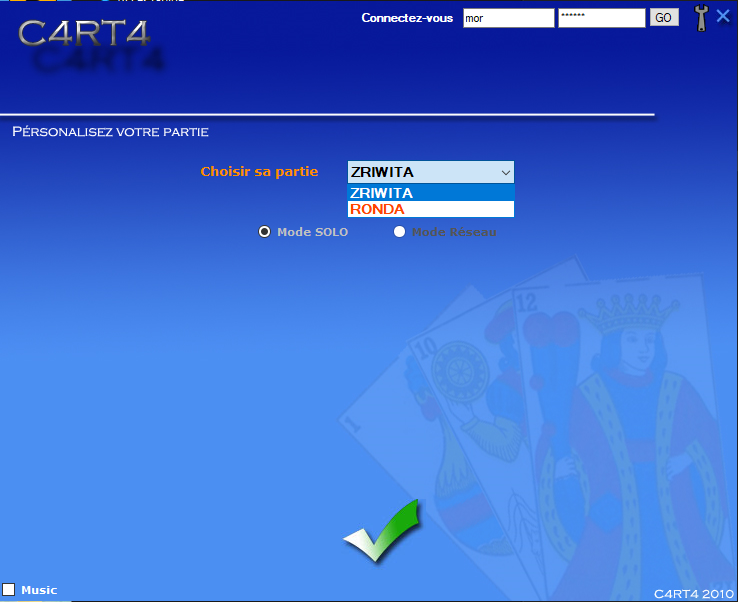
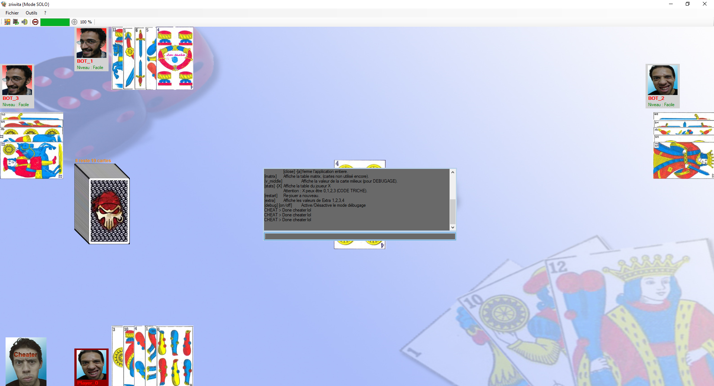

# C4RT4 v2 2011 (discontinued)

Jeu de cartes Marocaine / Morrocan Game Cards

2 jeux / 2 games

 'Alt + D'  cheat code ;)

Il y à normalement une API web pour pouvoir se connecter et jouer en ligne mais le domaien www.c4rt4.com n'est plus en ligne.
un backup de l'api sera partagé bientôt.

A web api si not yed added to make it work over network, a domaine name www.c4rt4.com is expared by the way, i will look for if i have a backup of my web api

L'executable se trouve dans le fichier bin/Debug, aucun install
Une terminologie, lexique et une voix Marocaine

Executable file is in bin/Debug directory, no installer
Morrocan lexical, terminologies and voice lol

Le projet na pas été achevé, a savoir qu'un seul jeu est jouable en solo et l'autre en réseau
Project is not achieved, there is only 1 game in solo and the other one needs network join party
